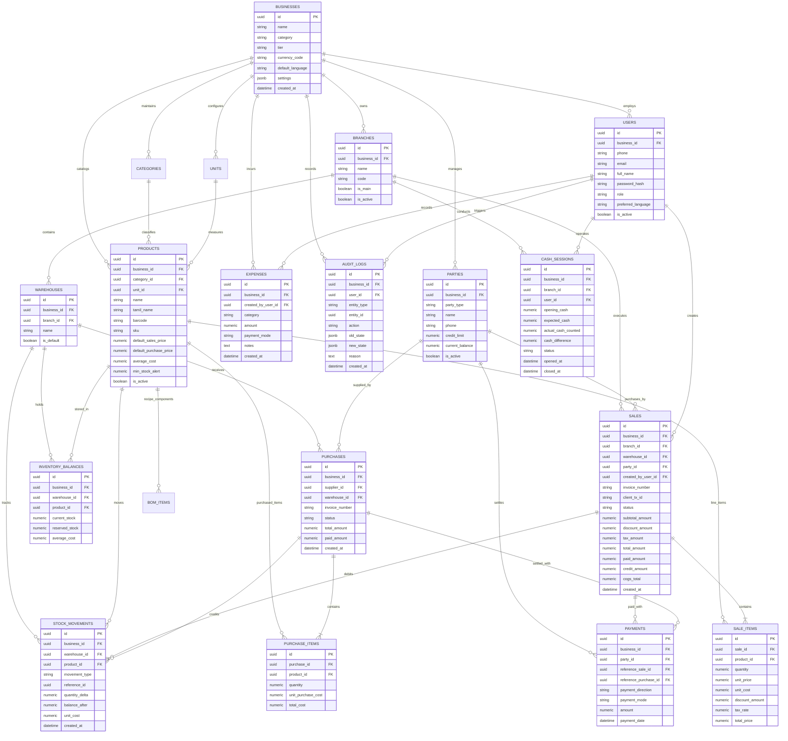

# KANAKKU (கணக்கு) — Entity Relationship (ER) Diagram

```mermaid
erDiagram
    BUSINESSES ||--o{ BRANCHES : owns
    BUSINESSES ||--o{ USERS : employs
    BUSINESSES ||--o{ CATEGORIES : maintains
    BUSINESSES ||--o{ UNITS : configures
    BUSINESSES ||--o{ PRODUCTS : catalogs
    BUSINESSES ||--o{ PARTIES : manages
    BUSINESSES ||--o{ EXPENSES : incurs
    BUSINESSES ||--o{ AUDIT_LOGS : records

    BRANCHES ||--o{ WAREHOUSES : contains
    BRANCHES ||--o{ CASH_SESSIONS : conducts
    BRANCHES ||--o{ SALES : executes

    WAREHOUSES ||--o{ INVENTORY_BALANCES : holds
    WAREHOUSES ||--o{ STOCK_MOVEMENTS : tracks
    WAREHOUSES ||--o{ PURCHASES : receives

    CATEGORIES ||--o{ PRODUCTS : classifies
    UNITS ||--o{ PRODUCTS : measures

    PRODUCTS ||--o{ INVENTORY_BALANCES : stored_in
    PRODUCTS ||--o{ STOCK_MOVEMENTS : moves
    PRODUCTS ||--o{ SALE_ITEMS : line_items
    PRODUCTS ||--o{ PURCHASE_ITEMS : purchased_items
    PRODUCTS ||--o{ BOM_ITEMS : recipe_components

    PARTIES ||--o{ SALES : purchases_by
    PARTIES ||--o{ PURCHASES : supplied_by
    PARTIES ||--o{ PAYMENTS : settles

    SALES ||--|{ SALE_ITEMS : contains
    SALES ||--o{ PAYMENTS : paid_with
    SALES ||--o{ STOCK_MOVEMENTS : debits

    PURCHASES ||--|{ PURCHASE_ITEMS : contains
    PURCHASES ||--o{ PAYMENTS : settled_with
    PURCHASES ||--o{ STOCK_MOVEMENTS : credits

    USERS ||--o{ SALES : creates
    USERS ||--o{ EXPENSES : records
    USERS ||--o{ CASH_SESSIONS : operates
    USERS ||--o{ AUDIT_LOGS : triggers

    BUSINESSES {
        uuid id PK
        string name
        string category
        string tier
        string currency_code
        string default_language
        jsonb settings
        datetime created_at
    }

    BRANCHES {
        uuid id PK
        uuid business_id FK
        string name
        string code
        boolean is_main
        boolean is_active
    }

    WAREHOUSES {
        uuid id PK
        uuid business_id FK
        uuid branch_id FK
        string name
        boolean is_default
    }

    USERS {
        uuid id PK
        uuid business_id FK
        string phone
        string email
        string full_name
        string password_hash
        string role
        string preferred_language
        boolean is_active
    }

    PRODUCTS {
        uuid id PK
        uuid business_id FK
        uuid category_id FK
        uuid unit_id FK
        string name
        string tamil_name
        string barcode
        string sku
        numeric default_sales_price
        numeric default_purchase_price
        numeric average_cost
        numeric min_stock_alert
        boolean is_active
    }

    INVENTORY_BALANCES {
        uuid id PK
        uuid business_id FK
        uuid warehouse_id FK
        uuid product_id FK
        numeric current_stock
        numeric reserved_stock
        numeric average_cost
    }

    STOCK_MOVEMENTS {
        uuid id PK
        uuid business_id FK
        uuid warehouse_id FK
        uuid product_id FK
        string movement_type
        uuid reference_id
        numeric quantity_delta
        numeric balance_after
        numeric unit_cost
        datetime created_at
    }

    PARTIES {
        uuid id PK
        uuid business_id FK
        string party_type
        string name
        string phone
        numeric credit_limit
        numeric current_balance
        boolean is_active
    }

    SALES {
        uuid id PK
        uuid business_id FK
        uuid branch_id FK
        uuid warehouse_id FK
        uuid party_id FK
        uuid created_by_user_id FK
        string invoice_number
        string client_tx_id
        string status
        numeric subtotal_amount
        numeric discount_amount
        numeric tax_amount
        numeric total_amount
        numeric paid_amount
        numeric credit_amount
        numeric cogs_total
        datetime created_at
    }

    SALE_ITEMS {
        uuid id PK
        uuid sale_id FK
        uuid product_id FK
        numeric quantity
        numeric unit_price
        numeric unit_cost
        numeric discount_amount
        numeric tax_rate
        numeric total_price
    }

    PURCHASES {
        uuid id PK
        uuid business_id FK
        uuid supplier_id FK
        uuid warehouse_id FK
        string invoice_number
        string status
        numeric total_amount
        numeric paid_amount
        datetime created_at
    }

    PURCHASE_ITEMS {
        uuid id PK
        uuid purchase_id FK
        uuid product_id FK
        numeric quantity
        numeric unit_purchase_cost
        numeric total_cost
    }

    PAYMENTS {
        uuid id PK
        uuid business_id FK
        uuid party_id FK
        uuid reference_sale_id FK
        uuid reference_purchase_id FK
        string payment_direction
        string payment_mode
        numeric amount
        datetime payment_date
    }

    EXPENSES {
        uuid id PK
        uuid business_id FK
        uuid created_by_user_id FK
        string category
        numeric amount
        string payment_mode
        text notes
        datetime created_at
    }

    CASH_SESSIONS {
        uuid id PK
        uuid business_id FK
        uuid branch_id FK
        uuid user_id FK
        numeric opening_cash
        numeric expected_cash
        numeric actual_cash_counted
        numeric cash_difference
        string status
        datetime opened_at
        datetime closed_at
    }

    AUDIT_LOGS {
        uuid id PK
        uuid business_id FK
        uuid user_id FK
        string entity_type
        uuid entity_id
        string action
        jsonb old_state
        jsonb new_state
        text reason
        datetime created_at
    }
```
